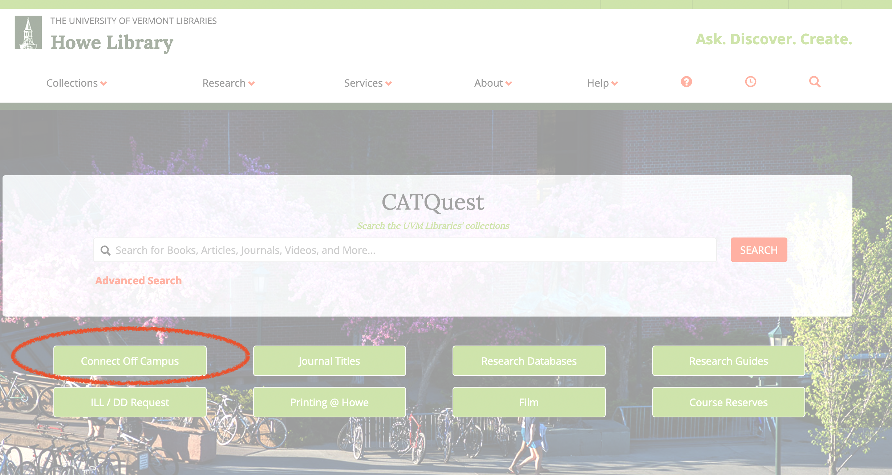
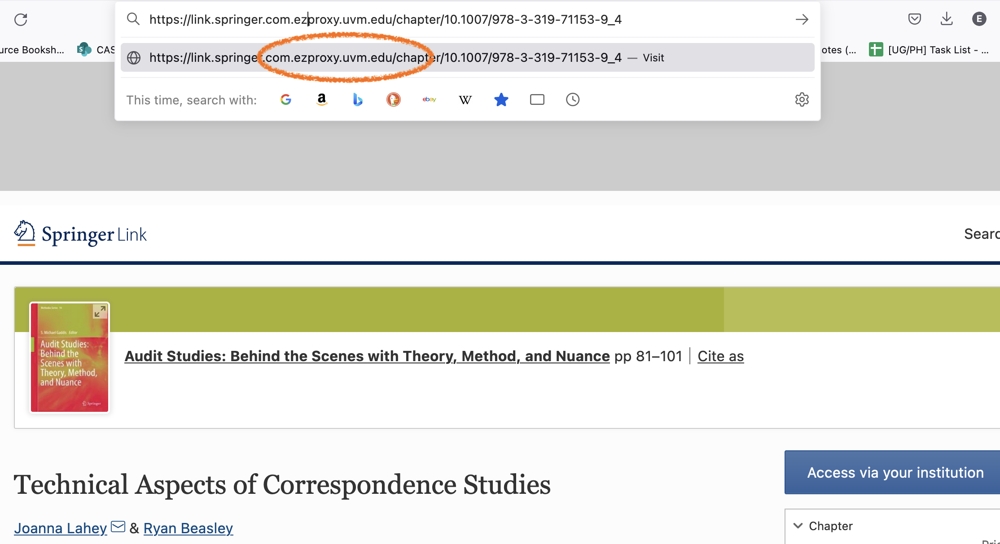
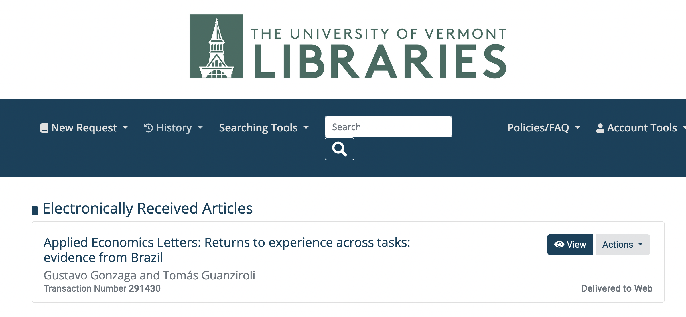
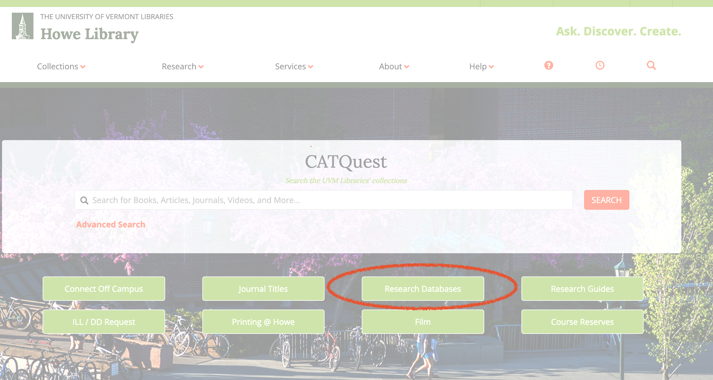

# Library Databases 

*[Back to index](index.html)*

[TOC]

## Accessing resources off campus 

What if you are at home, at a coffee shop, visiting friends in Korea? You can still access UVM library resources! 

**Option 1:** Click on the "Connect Off Campus" link at [library.uvm.edu](https://library.uvm.edu/)

**Option 2:** When you find what you're searching for, insert `ezproxy.uvm.edu` into the url *after* the domain and follow log-in instructions. You may need to click "advanced" if it upsets your browser permissions.

**Option 3:** Follow [library instructions](https://library.uvm.edu/help/access_library_resources_from_off_campus) to access a VPN

## What if the library doesn't have your journal article? 

[Due to disputes with Elesvier](https://library.uvm.edu/sites/default/files/documents/sd/ElsevierResolutionAndFAQs.pdf), who previously charged UVM $1.8 million/year for access to ScienceDirect, UVM no longer has access to the full range of popular academic journal articles. 

But never fear! 

You can request any academic journal article via [Interlibrary Loan (ILL)](https://illiad.uvm.edu/illiad/AtlasAuthPortal). Although the site says it could take 2–7 days, average turnaround times (as of 2021) were just 11.6 hours! 

Head to [ILL](https://illiad.uvm.edu/illiad/AtlasAuthPortal), log in, and make a "New Request." Then select "Journal Article" and fill in all the details. Easy!

 

## Useful Library Databases 

Head to the ["Research Databases"](https://library.uvm.edu/research/research_databases) to find all sorts of treasures! 

- Academic Search Premier: Recommended interdisciplinary search tool. If looking for peer-reviewed articles, make sure to check the "peer reviewed" box! 
- EconLit: Great for finding published articles within the economics literature. Also has that great "peer reviewed" check-box.

***[Back to index](index.html)***