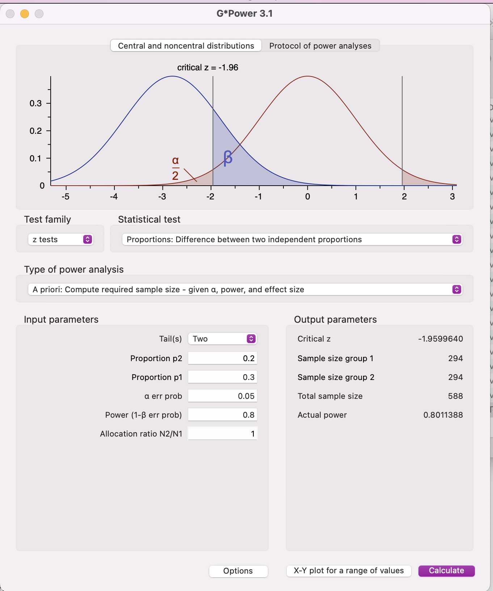
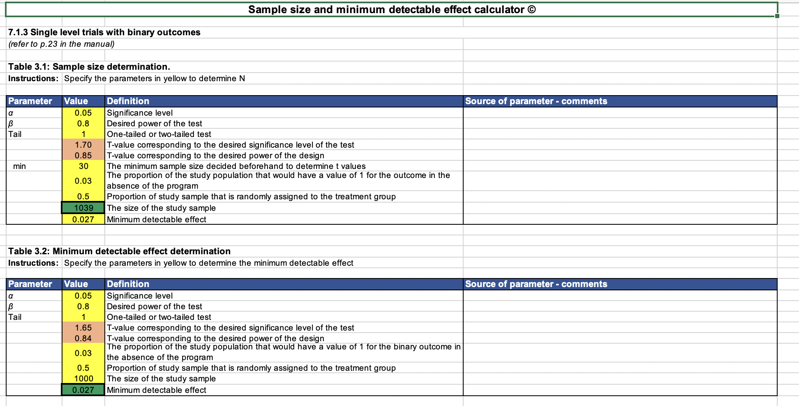

# Power Calculations 

*[Back to index](index.html)*

[TOC]

This is a very cursory overview of power calculations.

 JPAL has a great resource, ["Power Calculations,"](https://www.povertyactionlab.org/resource/power-calculations)  that is more comprehensive and still suitable for non-experts. Check out Figures 1 and 2! (Skip the portion about clustered designs. None of us are implementing this type of study, which increases the complexity substnatially!)

At the root of everything we are doing, we are trying to estimate a true *parameter.* Parameters are defined for an entire population, but we are working with a sample, hence the *estimation*. What that parameter is depends on our outcomes and research design. Perhaps it's the impact of race on the likelihood of a callback. Perhaps it's the impact that gender has on the return to education. Perhaps it's something else. 

For your study, your main outcome will most likely be a rate of some sort: callback rate, response rate, etc. You may have other outcomes, but we will stick with the main outcome for simplicity. 

You will construct a hypothesis test for that parameter. It may look something like this: 

$H_0: \delta = 0$

$H_a: \delta \neq 0$ 

Where $\gamma$ is the difference in callback rates between the two groups. 

or (equivalently) like this

$H_0: \gamma_{call,b}= \gamma_{call,w}$

$H_a: \gamma_{call,b} \neq \gamma_{call,w}$

where $\gamma_{call,g}$ is the callback rate for group $g$, here defined as black ($b$) or white ($w$)

The underlying idea of a hypothesis test is that if our estimates are very far away from our null hypothesis (ie $\hat\delta >>0$), then we should reject the null hypothesis (exceeding some critical value).  And if we don't have enough evidence, then we "fail to reject"

## What is statistical power?

**Power** is the likelihood that we correctly reject the null when the null is false.  That is, if it's the case that there is a true difference in callback rates, that we are able to reject our null hypothesis. 

We can write power as $(1-\beta)$, where $\beta$ is the probability of Type II error (failing to reject when the null is false)

The standard level of power used in academic work is 0.8 (ie an 80% chance that we correctly reject a false null hypothesis). However, some scholars argue that for some situations, such as when policymakers *have* to choose between two potential policies, a lower threshold is acceptable.

There are two ways we can think about this: 

1. We can estimate the true parameter/effect size, pick a sample size, and calculate power 
2. We can pick a sample size, set power to 0.8 (or another threshold) and estimate the minimum detectable effect size.

## What affects statistical power? 

We have more power when we have a larger sample size (because our estimates are more precise). We have more power when the estimate is very far away from the null hypothesis (big effect)

- Significance level: We usually set $\alpha = 0.05$, which is the acceptable rate of Type I error: the probability that you falsely reject a true null hypothesis. Smaller $\alpha$ means it's harder to reject the null, which means lower power. 
- Subject design: Do you have a *within-subject* or *between-subjects* design? 
  - Between subjects: Comparisons only made between subjects. So each employer gets 1 resume, etc. 
  - Within subjects: Comparisons made with multiple observations per subject. So each employer gets multiple resumes, etc.
- Effect size 
- Variability: How much variance is there in the outcome? If you can explain it with other controls, that can reduce this variance and increase power. This may be a reason to focus on one or two geographic markets rather than the entire country, or to hold constant more elements of your profiles/submissions.

### So how do I get more power? 

- Increase your sample size!
- Increase the effect size (ie: make the features as salient as possible, etc.)
- Use a one-tailed test (instead of two-tailed). Note that two-tailed is typically standard, but you may have a hypothesized reason to go with one-tailed 
- Reduce the significance level. What if $\alpha = 0.1$? 
- Reduce variance: include relevant controls. If you can feasibly do a within-subject design (multiple submissions per employee) this can make a big difference

## How do I calculate statistical power and/or sample size? 

There are many tools and resources! Pick your poison. 

- **:star: Recommended :star: this [handy spreadsheet](https://www.3ieimpact.org/evidence-hub/publications/working-papers/power-calculation-causal-inference-social-science-sample) from 3ie,** which lets you calculate sample size or minimum detectable effect size.. Select "Download map (excel)" to access an extremely helpful workbook. The relevant tab is 7.1.3. See walk-through below. There is [full technical documentation](https://www.3ieimpact.org/sites/default/files/2019-01/wp26-power-calculation.pdf) available as well.

- :star: Using [G*Power](https://www.psychologie.hhu.de/arbeitsgruppen/allgemeine-psychologie-und-arbeitspsychologie/gpower).:star:: A free, well-documented program you can download for Mac or PC. Has a few nice features! 
  
  - If you use this, make sure you set up the appropriate test: "Proportions: difference between two independent proportions" using the "z tests" test family :point_down:
  
   
  
- Manually! For two proportions, you can calculate the minimum sample size for a given power level this way: $n_i = \frac{(z_{1-\alpha/2}+z_{1-\beta})^2\sqrt{p_1(1-p_1) + p_2(1-p_2)*r}}{(p_1-p_2)^2}$ 

  - Where $n_1$ is the *per-arm* sample size, $p_1$ is the expected proportion of one group and $p_2$ is the expected proportion of theother, and $r$ is the ratio of sample sizes between the two groups (usually 1).
  - The $z$ values are from a standard normal distribution, where $z_{1-\alpha/2}$ is the value at which $P(Z<z_{1-\alpha/2}) = 1-\alpha/2$. 
    - If $\alpha = 0.05$, then $z_{1-\alpha/2} = 1.96$. 
    - You can get this using Excel, for example, with `=NORM.S.INV(1-0.05/2)` for $\alpha = 0.05$
    - Same with $z_{1-\beta}$, where $\beta$ is the likelihood of type II error.
  - Alternatively, you can see the [technical documentation](https://www.3ieimpact.org/sites/default/files/2019-01/wp26-power-calculation.pdf) from 3ie.

- 

- Using other web resources, like [this one](https://select-statistics.co.uk/calculators/sample-size-calculator-two-proportions/) from Select Statistical Services (note that this one yields the sample size **per arm** with a two-arm study and equal split between the two arms) or [this one from GIGAcalculator](https://www.gigacalculator.com/calculators/power-sample-size-calculator.php) (I find this one quite straightforward!)

- In Stata. I find this easiest, but that's because I use Stata a LOT. You will need to download Stata from the [UVM Software Portal](https://software.uvm.edu/) first. 
  - You can type something like `power twoproportions 0.2 0.5, power(0.8)`to calculate the sample size you would need to have 80% power to detect a 30 percentage point difference in callback rates (20% for one group, 50% for another)
  - Or, you can type something like `power twoproportions 0.2 , power(0.8) n(200)`to determine that the minimum detectable effect size with a sample of 200 (100 in one group, 100 in another) and 80% power would be 17.86 percentage points relative to another group with a 20% response rate. 
  - You can type `help power` to find more options, like if you have more continuous outcome measures.

- In R. This is not where I'm an expert, but JPAL has resources [here](https://github.com/J-PAL/Sample_Size_and_Power).

### 3ie Walkthrough (recommended) 

Let's check out this [handy spreadsheet!](https://www.3ieimpact.org/sites/default/files/2017-11/3ie-sample-size-minimum-detectable-effect-calculator.xlsx)

1. Go to tab 7.1.3, which will lead you to "Single level trials with binary outcomes"

   - This is the right tab becuase a call-back, click, or response is a binary outcome - it can be yes or no. 
   - Don't touch the values in the orange or green cells

2. Option 1: "Table 3.1 Sample size determination"

   *Input your estimated response rates for each group, and it yields a sample size*

   1. **Significance level** : 0.05 is standard, but you can also use 0.10 if if your power is low/MDE is very high
   2. **One-tailed or two-tailed test**: Two-tailed is preferred, but you may want to set up a one-tailed test if your power is low/MDE is very high. 
   3. **Minimum sample size decided beforehand to determine t-values:** Put something close to your expected sample size, like 100 or 1000. (This is about setting the right t-values, and how quickly the t-distribution converges to a standard normal distribution). It doesn't make a big difference.
   4. **Proportion of the study population that would havea value of 1 for the outcome in the absence of the program:** Enter what you think is a reasonable response/callback rate for one group. For example, if you expect a 20% response rate for requests from White students, enter "0.2". 
      - Ideally, this is based on other studies.
   5. **Proportion of study sample that is randomly assigned to treatment group**: If you have two groups, men and women, then you'd have 0.5 (50%). Power is maximized when you have an even split 
   6. **Minimum detectable effect** Put your best guess at what you might expect to see in terms of difference. This is in percentage points. If you expect that there is a 20% response rate to requests from White students and a 15% response rate to requests from Black students, then the MDE is 0.05. 
      - Ideally, this is based on other studies 
      - Note the difference between percentage point and percent changes! The MDE is in percentage points. 
        - To highlight this, suppose there is a 5% call back rate. A 5 percentage point increase means that the callback rate is 10%. An increase from 5% to 10% is a 100% increase!. 

   It will output a sample size! Is that doable? Can you make it doable? Do you need to change your assumptions? 

3. Option 2: "Table 3.1 Sample size determination"

*Input your sample size and response rates for one group, and it will yield the minimum detectable effect size*

All elements are as before, except this time you enter a sample size and it outputs a minimum detectable effect size! Add that to the base rate (Proportion of the study population that would havea value of 1 for the outcome in the absence of the program) to get what the minimum response rate for your comparison group would have to be. 

## Complexities

### What if I submit multiple resumes/profiles to one person/business? 

Everything is the same, but $N$ equals number of resumes * businesses. So if you submit four resumes to 200 businesses, then $N$ = 800. 

If you do that, there is no improvement in power when implementing a t-test. 

However, if you are up for linear regression, you can include controls for each employer identity. This can explain a lot of variation, it's reaosnable to assume 60% of the variation. You can use Table 7.1.4 and put 0.6 for "Proportion of outcome variance explained by level 1 covariate(s)" - this will increase your power! 

### What if I want to include controls? 

If you are someone who has experience with linear regression, you may want to control for all sorts of factors like time of day, industry, nature of work experience, etc. 

You can conduct your power calculations as above, which is essentially a lower bound. If you want to make an assumption about how much variance they explain (0.1–0.2 is pretty reasonable unless it's something like an employer fixed effect), then you can use Table 7.1.4 and put that number for "Proportion of outcome variance explained by level 1 covariate(s)" - this will increase your power! 

### What if I have other outcome variables? 

Let's do power calculations just for one main binary outcome. 

### What if I have more "cuts" in my sample? (3 groups, 4 groups, etc)

Set up your comparisons as between two groups: A vs B. How big are those groups? It could be 25% of your sample vs 25% of your sample. The total sample size speaks to those that are part of your test. Adjust proportions and total sample size accordingly. 

## Additional Resources 

- [Statistical Power in Hypothesis Testing—Visually Explained](https://towardsdatascience.com/statistical-power-in-hypothesis-testing-visually-explained-1576968b587e)
- JPAL: Statistical Power](https://www.povertyactionlab.org/resource/power-calculations)

- [JPAL: Quick Guide to Power Calculations](https://www.povertyactionlab.org/resource/quick-guide-power-calculations)
- [JPAL: Six Rules of Thumb for Sample Size and Statistical Power](https://www.povertyactionlab.org/sites/default/files/research-resources/2018.03.21-Rules-of-Thumb-for-Sample-Size-and-Power.pdf)
- [EGAP: Ten Things to Know about Statistical Power](https://egap.org/resource/10-things-to-know-about-statistical-power/)
- 

***[Back to index](index.html)***